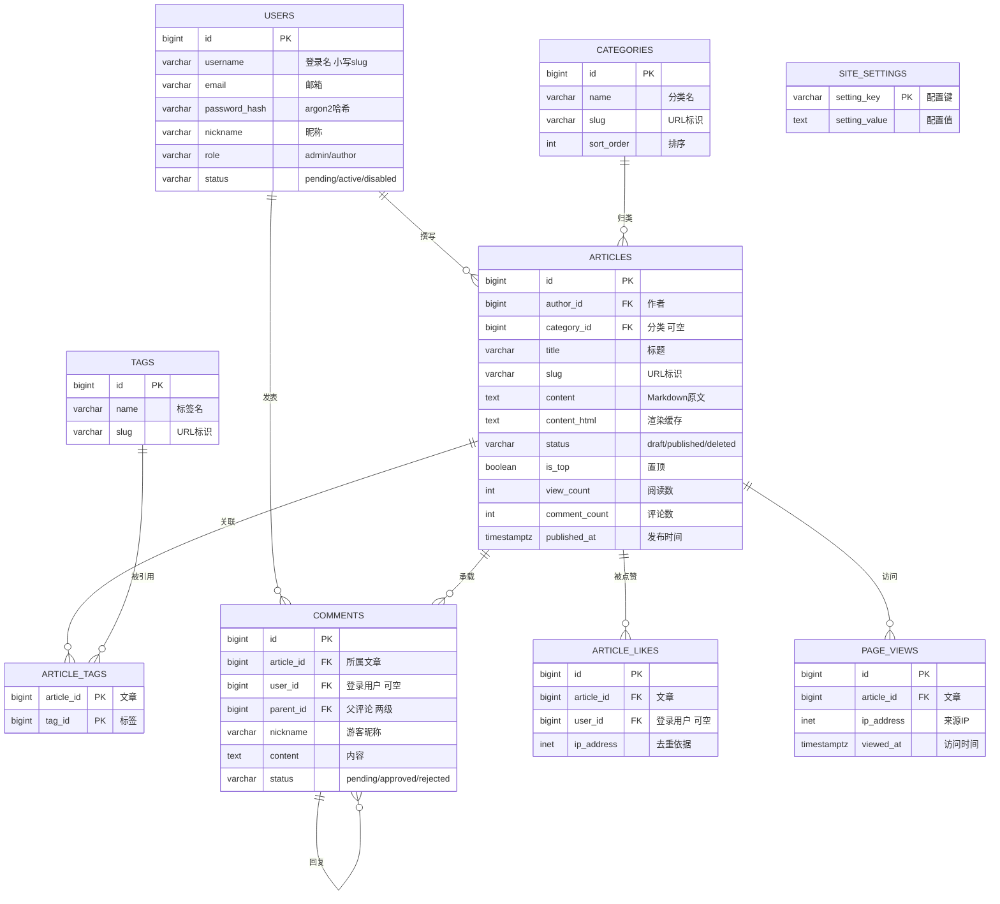

# 博客平台 · 数据库设计说明（Step 4）

> 日期：2026-09-17 ｜ 依据：`01-需求规格说明.md` (v2)
> DBMS：**PostgreSQL 18** ｜ 建表脚本：`db/schema.sql`
> ER 图：本文内嵌 mermaid 源码；渲染版见 `docs/ER图.html`

---

## 1. 概览

**9 张表 + 1 个视图 + 4 个枚举类型 + 5 组触发器。**

---

## 2. 表清单与职责

| 表 | 中文名 | 职责 | 预估行数 |
| --- | --- | --- | --- |
| `users` | 账号 | 作者与管理员统一存储，`role` 区分，`status` 三态控制准入 | ≤ 100 |
| `categories` | 分类 | 单层分类，仅管理员可维护 | ≤ 50 |
| `tags` | 标签 | 多对多标签，作者可自建 | ≤ 300 |
| `articles` | 文章 | 核心表，Markdown 原文 + 渲染缓存 + 冗余计数 | ≤ 1000 |
| `article_tags` | 文章-标签 | 多对多中间表 | ≤ 5000 |
| `comments` | 评论 | 登录用户与游客双身份，两级结构 | ≤ 1 万 |
| `article_likes` | 点赞去重 | 防止同 IP 重复点赞的依据表 | ≤ 5 万 |
| `site_settings` | 站点配置 | KV 结构，加配置项不改表 | ≤ 50 |
| `page_views` | 访问明细 | 阅读记录，未来可分区 | ≤ 百万 |
| `v_published_articles` | 视图 | 前台列表专用，省掉每次三表 JOIN | — |

---

## 3. 关键设计决策

### 3.1 表名用 `users` 而不是 `user`

`user` 是 SQL 标准保留字（等价于 `current_user`），用它做表名每次查询都得写双引号 `"user"`，是极常见的踩坑点。统一用复数 `users`。

### 3.2 登录名与展示名分离

- `username`：全小写 slug（`^[a-z0-9][a-z0-9_-]{2,49}$`），**兼作作者主页 URL** `/author/{username}`，注册时后端强制转小写。
- `nickname`：展示名，允许中文、允许大小写。

这样既避免了 `Alice` / `alice` 并存导致的大小写歧义，又不必为了 URL 友好牺牲展示效果。邮箱的唯一性则走**函数索引** `lower(email)`，因为邮箱按惯例大小写不敏感。

### 3.3 文章正文双存：`content` + `content_html`

`content` 是 Markdown 原文，**唯一真实来源**，导出/迁移只认它；`content_html` 是渲染缓存，避免每次请求都跑一遍 markdown-it + 高亮。渲染管线升级后可以整列重算，不丢数据。

### 3.4 冗余计数用触发器维护，别在应用层手改

`articles` 上的 `view_count` / `like_count` / `comment_count` 是冗余字段（否则列表页每篇都要 `count(*)`）。维护分工要明确，否则一定会重复计数：

| 字段 | 维护方 | 原因 |
| --- | --- | --- |
| `comment_count` | **触发器**（只统计 `approved`） | 状态流转复杂，触发器最可靠 |
| `like_count` | **触发器** | 由 `article_likes` 表派生 |
| `view_count` | **应用层 `+1`** | 读写太频繁，挂触发器不划算 |

### 3.5 两级评论的约束下沉到数据库

`parent_id` 自关联本身拦不住"回复的回复"。除了外键，还加了 `fn_comment_check_depth()` 触发器强制三条规则：父评论必须存在、必须属于同一篇文章、父评论本身必须是顶级评论。**约束写在数据库层，应用层写错也进不去脏数据。**

### 3.6 中文搜索方案（这里有个坑）

PostgreSQL 的 `tsvector` 用 `simple` 配置**不做中文分词** —— 一整句中文会被当成一个 token，搜"数据库"匹配不到"数据库设计"。而 `pg_jieba` / `zhparser` 需要额外编译安装，对单机自托管是真金白银的运维成本。

所以采取**双轨方案**：

| 场景 | 方案 | 索引 |
| --- | --- | --- |
| 中文关键词 | `ILIKE '%关键词%'` 子串匹配 | `GIN (title gin_trgm_ops)`、`GIN (summary gin_trgm_ops)` |
| 英文/混合词 | `to_tsvector` 全文检索 + 权重排序 | `GIN (search_vector)` |

`pg_trgm` 是 PostgreSQL 自带 contrib 扩展，按**字符三元组**切分，对中文有效。这是不增加任何运维成本就能拿到可用中文搜索的最优解。日后再装 `pg_jieba`，只需把触发器里的 `'simple'` 换成 `'jiebacfg'` 并重建一次即可平滑升级。

### 3.7 评论表用一张表承载两种身份

登录用户与游客共用 `comments` 表，靠 `user_id` 是否为空区分：

- `user_id` 非空 → 登录用户，昵称头像取 `users` 表
- `user_id` 为空 → 游客，`nickname` 必填（`ck_comments_identity` 保证不会出现"无主的匿名评论"）

比"建两张表再 UNION"简单得多，且两种身份的审核流程完全一致。

### 3.8 点赞去重必须落库

需求是"按 IP + 文章去重"。只有 `like_count` 一个数字是**无法去重**的 —— 不知道某个 IP 是否点过。所以加了 `article_likes` 表，`UNIQUE (article_id, ip_address)` 是去重的真正依据，`like_count` 只是它的缓存。

### 3.9 状态用枚举而非字符串

`article_status` / `comment_status` / `user_role` / `user_status` 都用 PostgreSQL 原生 `ENUM`。好处是存的是整数、写入时自动校验、`EXPLAIN` 可读。代价是加值需要 `ALTER TYPE ... ADD VALUE`（PG 12+ 支持事务外快速添加），对本项目足够。

### 3.10 `page_views` 预留分区能力

访问明细会随时间线性增长。当前规模（≤1000 PV/日）单表完全够用，若累计超过千万行，按 `viewed_at` 做月度分区即可，不需要改查询。

---

## 4. 外键与删除策略

删除策略是**故意不一致**的，每条都有理由：

| 外键 | 策略 | 理由 |
| --- | --- | --- |
| `articles.author_id → users.id` | `RESTRICT` | 作者还有文章就不让删账号，强制走"禁用"而非物理删除 |
| `articles.category_id → categories.id` | `SET NULL` | 删分类不该连坐文章，文章变"未分类"即可 |
| `article_tags.*` | `CASCADE` | 中间表纯关联，无独立价值 |
| `comments.article_id → articles.id` | `CASCADE` | 文章真删了，评论留着没意义 |
| `comments.user_id → users.id` | `SET NULL` | 删账号后评论降级为"匿名游客"，内容不丢 |
| `comments.parent_id → comments.id` | `CASCADE` | 父评论删了，回复一起走 |
| `article_likes.*` | `CASCADE` | 同 `article_tags` |

---

## 5. 索引清单

| 索引 | 表 | 类型 | 服务的查询 |
| --- | --- | --- | --- |
| `uk_users_email_lower` | users | 唯一函数索引 | 邮箱登录、注册查重 |
| `idx_users_status` | users | B-tree | 后台"待审核用户"列表 |
| `idx_articles_feed` | articles | **部分索引** `WHERE status='published'` | 首页文章流（最热查询） |
| `idx_articles_top` | articles | 部分索引 | 置顶优先的排序 |
| `idx_articles_draft` | articles | 部分索引 | 作者自己的草稿箱 |
| `idx_articles_search_vector` | articles | GIN | 英文全文检索 |
| `idx_articles_title_trgm` | articles | GIN trgm | **中文标题搜索** |
| `idx_articles_summary_trgm` | articles | GIN trgm | **中文摘要搜索** |
| `idx_article_tags_tag` | article_tags | B-tree | 标签页反查文章 |
| `idx_comments_article` | comments | B-tree | 文章详情页评论列表 |
| `idx_comments_pending` | comments | 部分索引 | 后台待审评论 |
| `idx_page_views_article` | page_views | B-tree | 单篇阅读趋势 |

**部分索引（partial index）**是这里的关键优化：前台只查 `status='published'` 的文章，把草稿和回收站排除在索引外，索引体积更小、命中更快。

---

## 6. 触发器清单

| 触发器 | 时机 | 作用 |
| --- | --- | --- |
| `trg_*_updated_at` × 4 | BEFORE UPDATE | 自动维护 `updated_at` |
| `trg_articles_search_vector` | BEFORE INSERT/UPDATE OF title,summary,content | 重建全文检索向量 |
| `trg_comments_check_depth` | BEFORE INSERT/UPDATE | 强制两级评论、父评论同文章 |
| `trg_comments_sync_count` | AFTER INSERT/UPDATE/DELETE | 同步 `articles.comment_count` |
| `trg_likes_sync_count` | AFTER INSERT/DELETE | 同步 `articles.like_count` |

---

## 7. 与 Step 5 的衔接

1. `db/schema.sql` 是**数据库层面的权威定义**，可直接 `psql -f` 执行。
2. Step 5 会按本脚本生成等价的 `prisma/schema.prisma`，让 ORM 与数据库定义保持一致；后续结构变更走 Prisma migration，不再手改这个脚本。
3. **管理员账号不在此脚本创建** —— 密码需要 argon2 哈希，由 Step 5 的 seed 脚本生成，避免哈希算法不一致导致登录失败。
4. 站点配置已预置 13 项（`site_settings`），后台"站点设置"页直接读它。

---

## 8. 两个可选升级项（不影响 v1 上线）

| 项 | 何时做 | 成本 |
| --- | --- | --- |
| 装 `pg_jieba` 获得真正的中文分词 | 中文搜索体验不满意时 | 需自定义 PG 镜像，重编译扩展 |
| `page_views` 按月分区 | 累计超过千万行 | 一次 `ALTER TABLE ... PARTITION BY`，查询无需改 |
